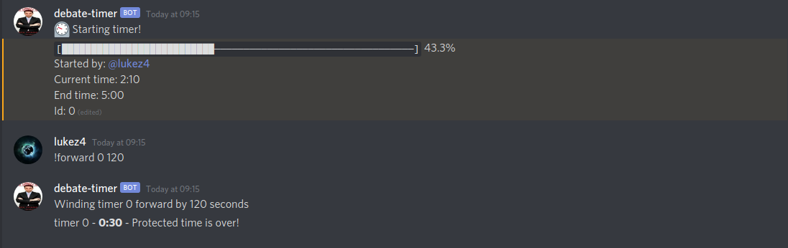

<h1 align="center">Debate Timer Bot</h1>

<p align="center">A flexible, powerful, and user-friendly general-purpose debate Discord Bot</p>

<p align="center"><a href="https://luke-zhang-04.github.io/debate-timer/">Web Timer</a></p>

<p align="center">
    <a href="https://aws.amazon.com/"></a>
    <br/>
    <a href="https://github.com/Luke-zhang-04/debate-timer/actions"></a>
    <a href="#nodejs-versions"></a>
    <a href="https://github.com/Luke-zhang-04/debate-timer/blob/master/LICENSE"></a>
</p>


<p align="center">
    <a href="#features-rundown">Features</a> •
    <a href="#compared-to-other-bots">Compared to Other Bots</a> •
    <a href="#nodejs-versions">NodeJS Compatibility</a> •
    <a href="#setup">Setup</a>
    <p align="center"></p>
</p>

## Features Rundown
- Timer
    - You can start, stop, pause, and resume timers
    - You can wind timers forwards or backwards
- Motions
    - Get up to 20 motions by default, complete with info slides and ensuring messages don't exceed Discord message maximums
    - All motions are from the [HelloMotions spreadsheet](https://docs.google.com/spreadsheets/d/1qQlqFeJ3iYbzXYrLBMgbmT6LcJLj6JcG3LJyZSbkAJY/edit#gid=2007846678)
- Team Generation
    - Generate random teams, partners, and create draws and rounds
- Broadcasting
    - Reply to a message and broadcast it to all channels that match a [regex](https://developer.mozilla.org/docs/Web/JavaScript/Guide/Regular_Expressions/Cheatsheet) argument
    - For example, you can reply to a motion and run `!broadcast poi`. This will broadcast a message too all chats which match the [regex](https://developer.mozilla.org/docs/Web/JavaScript/Guide/Regular_Expressions/Cheatsheet) `poi`
    - Admin only
- Coinfip and dice
- Fuzzy String Matching
    - Automatically corrects typos (e.g `hekp` -> `help`, `star` -> `start`)
- Simple Syntax
    - Straightforward syntax makes this bot easy to use (e.g `!start 5` instead of `+start {5}`)


## Compared to Other Bots
Why use this bot over other existing bots?
Namely the widely used bot [CUDS NotTDBot](https://github.com/spiltbeans/NotTDBot)

1. **Live Speech Timer** - a progress bar and current time is displayed and continuously changed, so you don't have to speculate time. Unlike the NotTDBot, this bot can reliabily time you and can replace your phone.
2. **Configurable** - host the bot yourself and configure it to your liking with YAML
3. **User Friendly** - created with ease of use in mind
    1. Simple autocorrect (e.g `hekp` -> `help`, `star` -> `start`)
    2. Syntax is straighforward (e.g `!start 5` instead of `+start {5}`)
4. **Other Functions** - features such as random motions, team generation, and some other useful debate commands are included.


## NodeJS Versions
This bot only works on Node JS >= 12. This is because Discord JS only supports Node >= 12. Therefore, we don't test for, nor support Node JS 10 or 8.

When installing Node JS for the first time with a package manager such as Yum or DNF, it may install Node 10. Make sure you install Node 12.

## Setup
***These steps are applicable to Linux and MacOS, but not necessarily Windows, unless you're using something like git-Bash***
If you're using Windows, you'll have to do everything yourself.

Make sure you have git installed. If not, you can download this package to a zip file.

1. Use one of the below methods
Stable release with pre-built bundle
```bash
# Git clone
git clone --single-branch --branch release https://github.com/Luke-zhang-04/debate-timer.git && cd debate-timer
```
Lastest features, which you have to build yourself (no big deal)
```bash
git clone --single-branch --branch master https://github.com/Luke-zhang-04/debate-timer.git && cd debate-timer
```

2. Install dependencies
```bash
./install.bash

# Or
bash install.bash
```

3. Get credentials
- You need to put a [Google Sheets API key](https://developers.google.com/sheets/api/quickstart/js#step_1_turn_on_the) in your .env file for the value APIKEY
- You need to put your [Discord auth token](https://github.com/Tyrrrz/DiscordChatExporter/wiki/Obtaining-Token-and-Channel-IDs) in your .env file for the value AUTHTOKEN

Note that these values are sensitive and should not be shown publicly

4. Run
```bash
./bot.mjs

# To run it in the background
./bot.mjs & disown

# Other ways you can run
node .
node bot.mjs
```

### CLI
The CLI is a REPL that lets you send messages on behalf of the bot

Run
```bash
node cli
```

And type `help` for help
