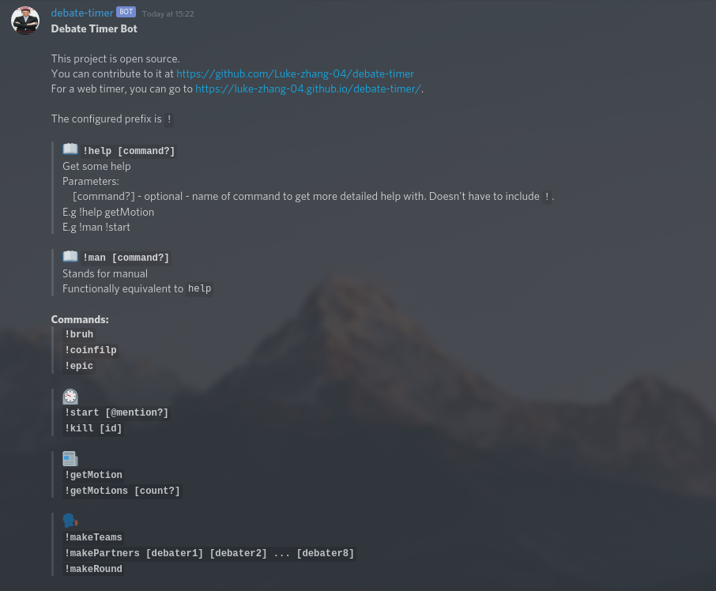

# Debate timer bot

A discord bot and web timer

<p align="center">
    <a href="https://aws.amazon.com/"></a>
    <a href="https://github.com/Luke-zhang-04/debate-timer/actions"></a>
</p>

[Web timer](https://luke-zhang-04.github.io/debate-timer/)



## Using the bot

Clone the latest version from git like so
```bash
git clone --single-branch --branch release https://github.com/Luke-zhang-04/debate-timer.git && cd debate-timer
```

Install dependencies
```bash
./install.bash

# Or
bash install.bash
```

Get credentials
- You need to put a [Google Sheets API key](https://developers.google.com/sheets/api/quickstart/js#step_1_turn_on_the) in your .env file for the value APIKEY
- You need to put your [Discord auth token](https://github.com/Tyrrrz/DiscordChatExporter/wiki/Obtaining-Token-and-Channel-IDs) in your .env file for the value AUTHTOKEN

Note that these values are sensitive and should not be shown publicly

Run
```bash
node .
```
